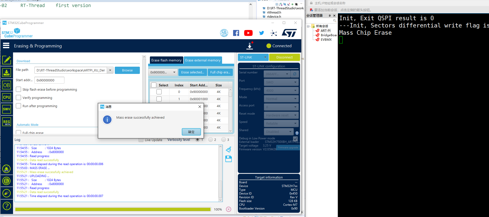

# STM32H750XBH_ARTPIQSPI_W25Q64JV
ARTPI STLDR - QSPI Flash W25Q64JV Download Algorithm

本程序适用于ART-PI开发板，基于STM32H750XBH6和W25Q64JV制作，支持串口输出打印Init、Read、Write过程。暂时未做Verfiy程序。

测试环境：

ST CubeProgrammer 2.10.0

RT-Thread Studio 2.2.6

> 注意，为了个人测试方便，默认在两个文件夹中生成STLDR文件。用户可以删除或修改User自定义命令


在下载算法程序中，main.h中有三个宏

```c
#define DEBUG_WITH_UART
#define W25QXX_WRITE_DIFF
#define W25QXX_READ_BY_MEMORY_MAP
```

分别对应：

1. 使用串口4输出进行下载过程打印
2. W25Q64使用差分方式下载
3. W25Q64使用内存映射模式读取

三个宏可以任意组合使用。

目前上传到Github的版本中，默认开启了串口和差分下载。

如果取消串口打印，则下载时间会有2秒左右提升。

## ST CubeProgrammer中测试

Step1. 选中算法


Step2. 全片擦除



Step3. 读取0x90000000，确认已擦除


Step 4. 下载程序

由于默认用差分方式下载，所以每个扇区的内容与待写入的程序不同，耗时约10S左右。


Step 5. 复位开发板，程序成功运行


## RT-Thread Studio中测试

Step 1.在Studio中选中算法


Step 2. 在完成上述步骤后，在Studio中不修改程序，直接下载

由于程序没有任何变化，所以下载过程会提示扇区内容与待写入数据相同，并没有对扇区有任何擦除和写入操作。


Step 3. 修改程序的LOG，编译后再次下载。

如，修改如下LOG的最后一个字符

```c
LOG_I("Hello RT-Thread----------xyz2");
```

将2修改为3

```c
LOG_I("Hello RT-Thread----------xyz3");
```

此时只有某一个扇区有不同的数据，程序下载后，成功运行，且下载过程中串口输出结果表示，在扇区34处有数据不同，因此进行该扇区的擦除和写入。


Step 4. 确认在Studio中通过命令行调用STM32 CubeProg下载所花费的时间

在串口输出打印的情况下，差分下载约4秒。若关闭串口输出打印，时间约1-2秒。

